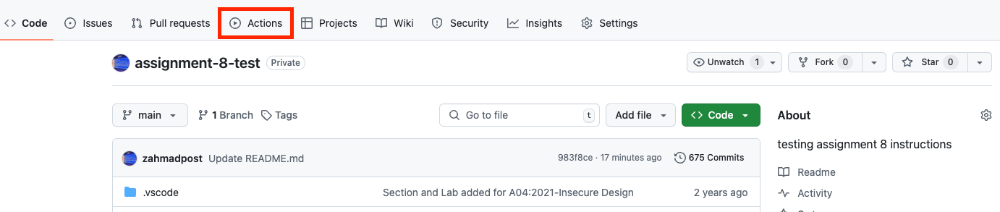
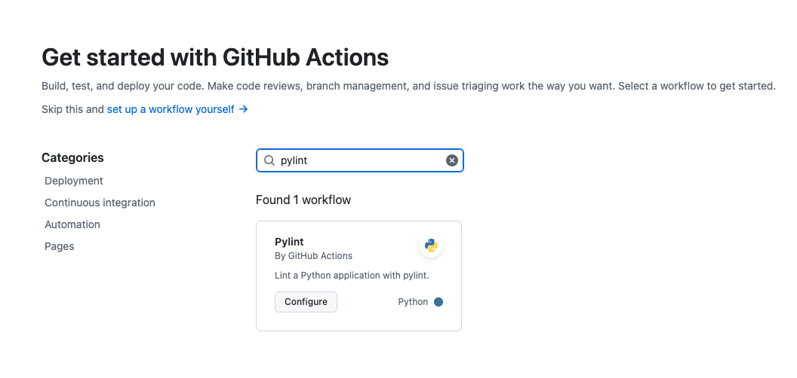
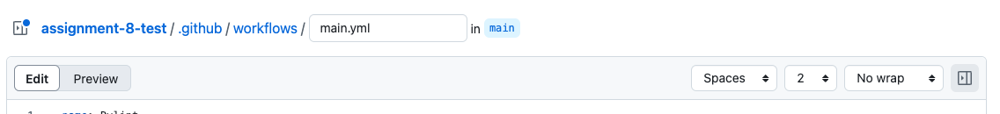
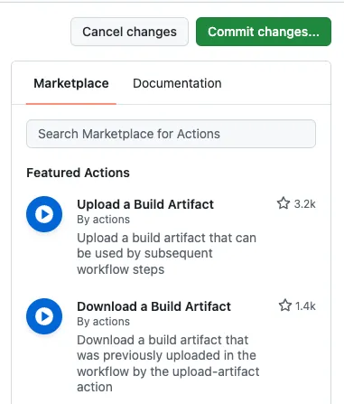
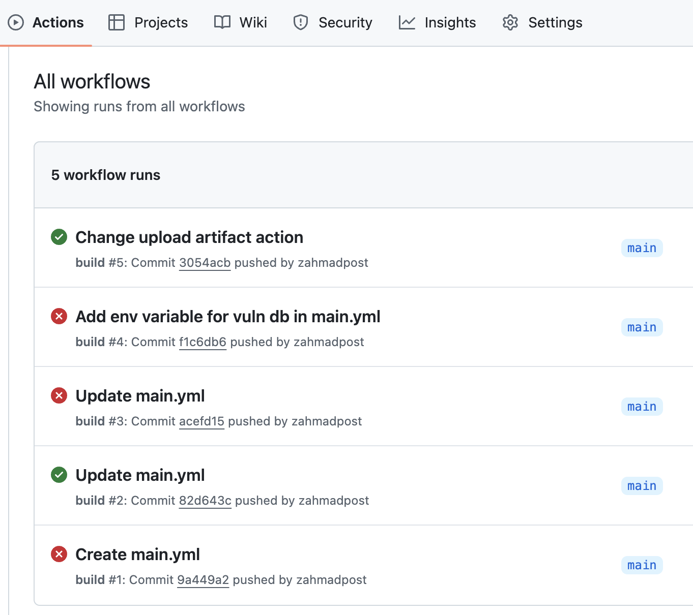

# Part 1: Code Scanning

In Part 1, we will use code scanning tools to scan the repository for vulnerabilities. There are different kinds of code scanning tools available- some are dynamic and some are static. Static code analysis are instruments that analyze your code and any dependencies that your code utilizes in order to detect vulnerabilities. 

Static code analysis is the process of running static code analysis tools that highlight possible vulnerabilities within static code- that is, code that is not running. The analysis is performed without executing the code, and involves examining the code’s structure and syntax without running the program. Dynamic code analysis is conducted during runtime while the code is being executed. It inspects the behavior of the program as it runs. 

Static code scanners are not perfect- the state of the art in static code analysis is not yet at the point where every detection is high confidence and there are no false negatives. Many security vulnerabilities are very difficult to automatically detect and current state of the art static code scanning tools can only automatically find a relatively small percentage of application security flaws. Additionally, there can be a high number of false positives in code scanning tooling, which can slow down the software release cycle. 

Static code analysis tools are often language-dependent. Not all scanners will support all programming languages. [NIST has great resources](https://www.nist.gov/itl/ssd/software-quality-group/source-code-security-analyzers) for finding appropriate code scanners for your use case. Because different scanners provide different functionality, it’s not uncommon for an organization to use multiple code scanning tools in the same environment. Two of my favorite static code scanners are [semgrep](https://semgrep.dev/) and [Snyk](https://snyk.io/). 

# Step 1: Clone the sample code repository and run locally

We’ll be using a fork of [OWASP’s pygoat application](https://owasp.org/www-project-pygoat/). This is a deliberately insecure web application written using the python [Django framework](https://www.djangoproject.com/). The [README](https://github.com/MIS547-Fall-2024/pygoat/tree/master) provides instructions for different ways of running pygoat locally. We’ll be using Docker compose to run the application locally to avoid as many OS-dependent issues as possible. 

1. Navigate to a directory on your local machine where you would like your project to live and then clone the repository:
    
    ```bash
    git clone https://github.com/MIS547-Fall-2024/pygoat.git
    ```
    
2. `cd` into the root of the cloned project directory and then build a docker image from the source repository:
    
    ```bash
    docker build -t pygoat .
    ```
    
3. Once the container image has built, run a container using:
    
    ```bash
    docker run --rm -p 8000:8000 pygoat
    ```
    
    1. note the `--rm` flag that we passed to our docker run command- this will remove the container after we’ve sent a shut down signal inside the running container. 
4. Navigate to 127.0.0.1:8000 to see the vulnerable web application running. You can use this web application as a sandbox for exploiting common web app vulnerabilities. Unfortunately, web application pen testing is outside the scope of this class, but I encourage you to keep this image around and spin it up if you ever feel like hacking your way through the OWASP top 10 vulnerabilities!
5. Once you’ve finished playing with the web application, stop the running container by entering `ctrl+c` inside the terminal with the running container.
6. Next, create a new repository in your personal GitHub profile. Name your repository `assignment-8-code-scanning` (or something similar). Then set your local project’s upstream to that repository and push your code: 
    
    ```bash
    git remote set-url origin <your.git.url.here>
    git branch -M main
    git push
    ```
    

# Step 2: Set up code scanning as part of CI workflow

Like we did in Assignment 7, we’ll add a GitHub Actions workflow to scan our code for vulnerabilities. 

1. At the top of your repo, select **Actions:**
    
    
    
2. In the GitHub Actions overview page, you’ll see many templates that are available to use a starting point for your own. It’s worthwhile to spend some time investigating these templates to understand the kinds of actions that you can use. For now, in the **Search workflows** dialog box, type **pylint**:
    
    
    
3. Click on **Configure**. This will create a directory in your repository called `.github` . Within that directory is a subdirectory called `workflows` . And within the `workflows` directory is a new file called `pylint.yml` . Let’s rename `pylint.yml` to `main.yml` :
    
    
    
4. Now let’s start to build out our GHA workflow to run a static code scan every time code is pushed or merged into the main branch. 
    
    1. First, we’ll name our workflow “CI”. Replace the first `name` key with the value `CI` :
    
    ```yaml
    name: CI
    ```
    
    1. Now, we’ll define when the job should run. GHA will automatically trigger a worfklow when the `on` key’s value is met. For a full list of availabble events, see “[Events that trigger workflows](https://docs.github.com/en/actions/using-workflows/events-that-trigger-workflows)”. You can use a single event or multiple events, passed as items in an array. We’ll use the event `push` to have our workflow run whenever code is pushed. You can leave line 3 in the generated yaml file as is:
    
    ```yaml
    name: CI
    
    on: [push]
    ```
    
    1. Now we’ll define the job that we want to run. Line 5 in the auto-generated yaml file starts the job definition. Let’s modify this section to set up our static code scan:
    
    ```yaml
    name: CI
    
    on: [push]
    
    jobs:
        sast_scan:
            name: Run Static Code Scan
            runs-on: ubuntu-latest
    ```
    
    - We define a new job as `sast_scan` and then start to pass definitions to it. The `name` is a descriptor of what the job will do (try to keep it short and descriptive).
    - Then we define the `runs-on` parameter. Every time a GHA job is run, GitHub creates serverless compute resources on which that job will execute. In this case, we are telling GHA to run the job on a VM running the latest Ubuntu release.
    1. Now we’ll define the steps that should be taken as part of the job. First, we need to checkout the code base. Then, we will make sure python is available on the VM that will be testing our code. Add the following to your main.yml file: 
    
    ```yaml
    name: CI
    
    on: [push]
    
    jobs:
        sast_scan:
            name: Run Static Code Scan
            runs-on: ubuntu-latest
            
            steps:
            - name: Checkout code
                uses: actions/checkout@v2
                
            - name: Set up Python
                uses: actions/setup-python@v2
                with:
                    python-version: 3.8
    ```
    
    - Note the `uses` key. GitHub Actions has many templates we can use to make jobs easier to define. `actions/checkout@v2` and `actions/setup-python@v2` are both pre-defined actions that we can use for our jobs. You can find a list of actions that are available in the Marketplace, listed on the right-hand navigation:
        
        
        
    - The `with` parameter needs to be defined for some actions. These will be documented for each step that you need to run.
    1. Now, we’ll add a step to install Trivy, a static code analysis tool maintained by Aqua Security. Semgrep is wonderful, but their Github Action is deprecated. Snyk is also excellent, but requires creating an additional account, and I’ve made y’all create enough accounts already. If you’d like to explore using Synk you may optionally create a Snyk account, and investigate adding Snyk as a static code scan step in your deployment pipeline! 
        - Add the following code to your `main.yml` file:
        
        ```yaml
        name: build
        on:
          push:
            branches:
              - main
          pull_request:
        jobs:
          sast_scan:
            name: Run Static Code Scan
            runs-on: ubuntu-20.04
            steps:
              - name: Checkout code
                uses: actions/checkout@v4
        
              - name: Run Trivy vulnerability scanner in repo mode
                uses: aquasecurity/trivy-action@0.28.0
                env:
                  TRIVY_DB_REPOSITORY: public.ecr.aws/aquasecurity/trivy-db:2
                with:
                  scan-type: 'fs'
                  ignore-unfixed: true
                  format: 'sarif'
                  output: 'trivy-results.sarif'
                  severity: 'CRITICAL'
        ```
        
        - Note the `scan-type` , `ignore-unfixed` , `format` , `output` , and `severity` fields. These are defined by Aqua as part of the `trivy-action@0.28.0` action. This is why it’s so important to read the maintainer’s documentation before using an action. These fields each come with a default value via the documentation:
            - `scan-type` :
                - Description: the type of scan to run
                    - Static code scanners will often have functionality to run image and code scans.
                - Default Value: # optional, default is image
                - Our setting: `'fs'` , which means `filesystem` .
            - `ignore-unfixed` :
                - Description: ignore unfixed vulnerabilities
                    - If you set this value to be `false` , your CI pipeline will throw an error, meaning any other automation that follows will not run. (For example, if you have automation in place to push an image to your image registry after the security scan has completed, your pipeline will not advance to that stage if unfixed vulnerabilities are present.)
                - Default value: # optional, default is false
                - Our setting: `true` We will use the output to inspect the vulnerabilities in the code; no need for massive amounts of failed pipeline jobs in our organization!
            - `format` :
                - Description: output format (table, json, template)
                    - This is the format of the file that is created after the scan is run.
                - Default value: # output format (table, json, template)
                - Our setting: `'sarif'`
            - `output` :
                - Description: writes results to a file with the specified file name
                - Default value: optional, default is comma separated list of directories where traversal is skipped
                - Our setting: `'trivy-results.sarif'` This is the name of the output file that will be generated after the scan is complete.
            - `severity` :
                - Description: severities of vulnerabilities to be displayed
                    - Note that every code base will have some number of vulnerabilities. Vulnerabilities are ranked according to the likelihood of exploitation, and the impact of exploitation. Code scanners usually classify vulnerabilities as LOW, MEDIUM, HIGH, and CRITICAL severity.
                    - Listing all vulnerabilities in a code base can lead to developer fatigue, and additional work that may not actually be required for a secure application. There’s also the possibility for false positive results in your scans- by setting your severity level to HIGH and CRITICAL, you can ensure that the most pressing vulnerabilities are addressed.
                    - As your organization (and code base) matures, you can decide to include MEDIUM severity as required and per your organization’s risk appetite.
                - Default value: HIGH,CRITICAL
                - Our setting: `'CRITICAL'`
                
                Note: There’s a field called `env` . This will download the Trivy vulnerability database from a public ECR registry instead of from the GHA marketplace hosted file because rate limiting?? It’s hacky, but it’s now Aqua’s officially updated workflow (as of like, October 1, 2024.) **¯\_(ツ)_/¯** 
                
        1. Next, we’ll set up a job to save the `trivy-results.sarif` file as an artifact of our pipeline. 
            
            <aside>
            
            💡SARIF stands for Static Analysis Results Interchange Format. It is a JSON-like format- it is highly extensible and can be used in specialized code scanning tools. 
            
            </aside>
            
            Add the following code to your `main.yml` file:
            
            ```yaml
            name: build
            on:
              push:
                branches:
                  - main
              pull_request:
            jobs:
              sast_scan:
                name: Run Static Code Scan
                runs-on: ubuntu-20.04
                steps:
                  - name: Checkout code
                    uses: actions/checkout@v4
            
                  - name: Run Trivy vulnerability scanner in repo mode
                    uses: aquasecurity/trivy-action@0.28.0
                    env:
                      TRIVY_DB_REPOSITORY: public.ecr.aws/aquasecurity/trivy-db:2
                    with:
                      scan-type: 'fs'
                      ignore-unfixed: true
                      format: 'sarif'
                      output: 'trivy-results.sarif'
                      severity: 'CRITICAL'
            
                  - name: Upload build artifact
                    uses: actions/upload-artifact@v4.4.3
                    with:
                      name: trivy-results
                      path: trivy-results.sarif
            ```
            
    
    7. Commit your `main.yml` file to your master branch.
    

# Step 3: Observe and Export the Scanning Results

We set up the workflow to run every time code is committed to the main branch. That means that by committing our `main.yml`  file, the GHA workflow will run. Navigate to the **Actions** tab again to watch your workflow in progress:



If your workflow successfully runs, you’ll have a green checkmark next to the workflow. This is an addictive green checkmark. It is now your only source of dopamine. Welcome to DevOps. 

Click on the successful run, and scroll down to the “Artifacts” box. You’ll see the `trivy-results` file there. 


You’re now ready to move on to **Part 2.**