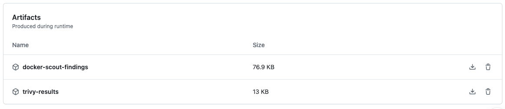

# Part 2: Scan the Container Image

Next, we’ll have GitHub actions run a container image scan. We’ll be using Docker Scout for our image scanning. Recall in Assignment 3 that we investigated our container layers’ vulnerabilities with Docker Scout in the Docker Desktop UI. We’ll use similar functionality in GHA but have the scans run as part of our `CI/CD` pipeline. We’ll export the results and investigate the findings. 

# Step 1: Update the CI Workflow

We’ll update our `main.yml`  file to include another job for container image scanning using Docker Scout. Note that this is a new *job*, so we need to start our definition at the same indentation level as our SAST scan job. Leave your existing code as is, and add a new job called `image_scan` that’s aligned with `sast_scan` . This job will also run on `ubuntu-latest`. 

```yaml
name: build
on:
  push:
    branches:
      - main
  pull_request:
jobs:
  sast_scan:
    name: Run SAST Scan
    ...... 
    image_scan:
       name: Build Image and Run Image Scan
       runs-on: ubuntu-latest
```

Next, we need to checkout our code, set up Docker, and then build the image from our Dockerfile. Add the code snippet in blue to your `image-scan` job: 

```yaml
name: build
on:
  push:
    branches:
      - main
  pull_request:
jobs:
  sast_scan:
    name: Run SAST Scan 
#...    
  image_scan:
       name: Build Image and Run Image Scan
       runs-on: ubuntu-latest

       steps:
       - name: Checkout code
         uses: actions/checkout@v4
    
       - name: Set up Docker
         uses: docker-practice/actions-setup-docker@v1
         with:
          docker_version: '20.10.7'
    
       - name: Build Docker Image
         run: docker build -f Dockerfile -t pygoat_app:latest .
```

# Step 2: Use GHA Secrets

Next, use GHA secrets to authenticate to your DockerHub registry. Add the following to your `main.yml` file:

```yaml
name: build
on:
  push:
    branches:
      - main
  pull_request:
jobs:
  sast_scan:
    name: Run SAST Scan
    ...... 
    image_scan:
       name: Build Image and Run Image Scan
       runs-on: ubuntu-latest

       steps:
       - name: Checkout code
         uses: actions/checkout@v4
    
       - name: Set up Docker
         uses: docker-practice/actions-setup-docker@v1
         with:
          docker_version: '20.10.7'
    
       - name: Build Docker Image
         run: docker build -f Dockerfile -t pygoat_app:latest .
        
       - name: Docker Scout Scan
         uses: docker/scout-action@v1.15.0
         with:
           dockerhub-user: ${{ secrets.REPO_USER }}
           dockerhub-password: ${{ secrets.REPO_PWD }}
           command: quickview,cves
           only-severities: critical,high
           sarif-file: scout-report.sarif
```

- To use Docker Scout functionality, we need to authenticate to Docker Hub. To do that, we need to pass two variables to our repository:
    - `secrets.REPO_USER`
        - This will be your Docker Hub username
    - `secrets.REPO_PWD`
        - This is your Docker Hub Personal Access Token (PAT) or password. PATs are beneficial because they can be scoped to a particular image, and allow for permissions scoping!
        - In Docker Hub, create a new PAT for Assignment 8!
- You can add these by following the instructions in [Assignment-7, Part 3: Configure CI/CD using GitHub Actions](https://github.com/MIS547-Fall-2024/Assignment-7/tree/main/Part_3_configure_ci_cd_using_gha) **Step 1: Add Secrets in GitHub**
    - The variables are named different things- this is because the action we used in Assignment 7 used a different docker action (i.e. `docker/login-action@v3` instead of `docker/scout-action@v1.15.0` )
    - Note the variable names (**secrets.REPO_USER** and **secrets.REPO_USER**). What does that tell you about where you need to save your username and PAT?
    
    <aside>
    
    💡It’s common for there to be multiple ways to piece together configurations from different templates. You’ve probably discovered this through your Docker image experimentation! Finding the best approach for your environment is done partly through experimentation, partly through understanding your environment’s unique requirements, partly through identifying contributors that you trust, and partly due to experience and preference. Just because you saw something done one way in one assignment doesn’t mean it’s the only way to achieve your goal. 
    
    </aside>
    

Lastly, we’ll use `actions/upload-artifact@v3` to save the results of our image scan to our pipeline’s artifacts.

```yaml
name: build
on:
  push:
    branches:
      - main
  pull_request:
jobs:
  sast_scan:
    name: Run SAST Scan
    ...... 
    image_scan:
       name: Build Image and Run Image Scan
       runs-on: ubuntu-latest

       steps:
       - name: Checkout code
         uses: actions/checkout@v4
    
       - name: Set up Docker
         uses: docker-practice/actions-setup-docker@v1
         with:
          docker_version: '20.10.7'
    
       - name: Build Docker Image
         run: docker build -f Dockerfile -t pygoat_app:latest .
        
       - name: Docker Scout Scan
         uses: docker/scout-action@v1.15.0
         with:
           dockerhub-user: ${{ secrets.REPO_USER }}
           dockerhub-password: ${{ secrets.REPO_PWD }}
           command: quickview,cves
           only-severities: critical,high
           sarif-file: scout-report.sarif
    
       - name: Upload Artifact
         uses: actions/upload-artifact@v3
         if: always()
         with:
           name: docker-scout-findings
           path: scout-report.sarif
```

Commit your code to your main branch, then navigate to the **Actions** tab to review the pipeline workflow.

# Step 3: View and Export the Container Scanning Results

- Just like we saw with our repository scan, our container scan results will be available as an artifact in our GitHub Actions workflow.



- You’re now ready to move onto **Part 3.**