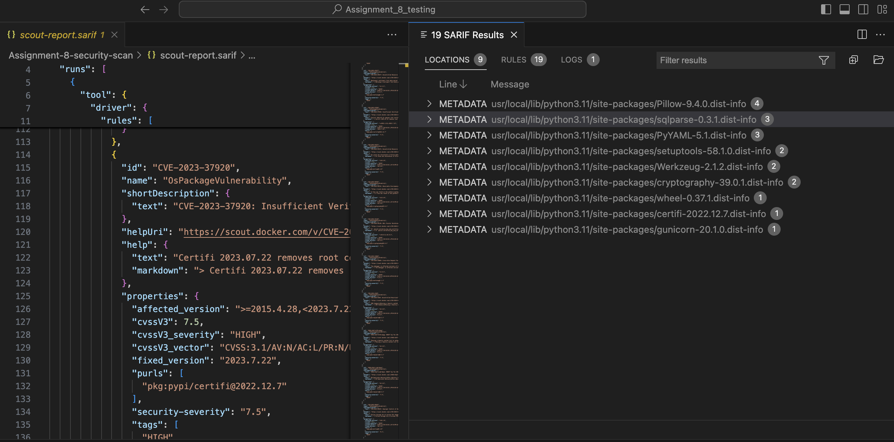

# Part 3: Remediations

If the pipeline you built in Parts 1 and 2 ran successfully, you should see two sarif files in your run’s artifacts:

- `docker-scout-findings`
- `trivy-results`

As previously discussed, these are SARIF files. Download these files (they will be downloaded as `.zip` files, and unzip them into the same local project directory that you used for cloning the Assignment 8 pygoat directory. Open VSCode to the location where your pygoat project lives.

We’ll use a VSCode extension by [Microsoft DevLabs called SARIF viewer](https://marketplace.visualstudio.com/items?itemName=MS-SarifVSCode.sarif-viewer) to inspect our SARIF files. Install the extension. Now, when you click on one of the SARIF files to view the results, a panel will open next to it that helps you to read the results:

Open the `trivy-results.sarif` file. Inspect the side panel. Look at the **LOCATIONS** tab and the **RULES** tab on the top navigation. 

Spend a little time looking around these vulnerabilities. 

# Step 2: Suggest Remediations for Vulnerabilities

In the repository you cloned, I’ve added a file called [`Assignment-8-Answers.md`](http://Assignment-8-Answers.md) 

To answer the questions, you’ll need to address **two** vulnerabilities in the pygoat web app. Follow the instructions below to answer the questions:

1. Using your SARIF files, identify a **CRITICAL** severity vulnerability. 
    1. These can either be from the scout results or from the trivy results.
2. What CVE is mapped to the vulnerability? Give a brief description of the vulnerability.
3. What is the recommended remediation for this vulnerability? 

You’ll need to do a little searching to understand the vulnerabilities and how to remediate them. Your SARIF file will get you 75% of the way there, but you’ll need to supplement the findings to make suggestions for how to remediate the vulnerabilities! 

# Final Deliverable:

Once you’ve answered the questions, commit your code to your repository, and then add a link to your repo in D2L under Assignment 8.